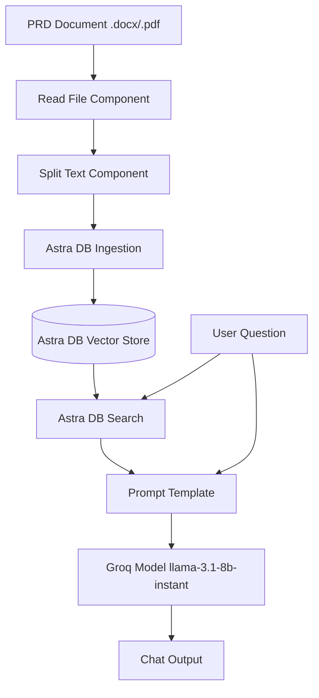

# Langflow PRD Reader & Question Answering System

This project is a Langflow-based workflow that automates the process of reading Product Requirements Documents (PRDs) and answering questions based on their content. It uses a Retrieval-Augmented Generation (RAG) approach to provide accurate answers by indexing document chunks into a vector database.

## 🚀 Overview

The workflow processes documents (like the VWO Login Dashboard PRD) by breaking them into manageable chunks, embedding them with high-performance NVIDIA models, and storing them in Astra DB. Users can then query the system to get specific details from the document.

## 🏗️ Architecture

## 🛠️ Tech Stack

- **[Langflow](https://www.langflow.org/)**: Workflow orchestration and UI.
- **[Astra DB](https://astra.datastax.com/)**: Vector database for storing and searching document embeddings.
- **[Groq](https://groq.com/)**: High-speed inference for LLMs (Llama 3.1).
- **NVIDIA Embeddings**: High-quality vector representation of text chunks.
- **Docling**: Advanced document parsing for complex formats.

## 📋 Features

- **Automated Document Parsing**: Extracts text from various file formats.
- **Intelligent Chunking**: Splits text with overlap to maintain context.
- **Vector Search**: Semantic retrieval of relevant sections based on user queries.
- **Context-Aware QA**: Generates answers using the retrieved context for high accuracy.

## ⚙️ Setup

1. **Import the Flow**:
   - Download the `langflow-tc-from-prd.json` file.
   - Import it into your Langflow instance.

2. **Configure Secrets**:
   - Ensure you have the following API keys/tokens:
     - **Groq API Key**
     - **Astra DB Application Token**
   - In Langflow, update the `Astra DB` and `Groq` components with your respective credentials.

3. **Database Configuration**:
   - Set the `API Endpoint` and `Collection Name` in the Astra DB component.

## 📄 Project Structure

- `langflow-tc-from-prd.json`: The exported Langflow workflow.
- `chats.md`: Sample interactions and outputs.
- `prompt-template.md`: The template used for passing context to the LLM.
- `groq.md`: System prompt for the Groq agent.
